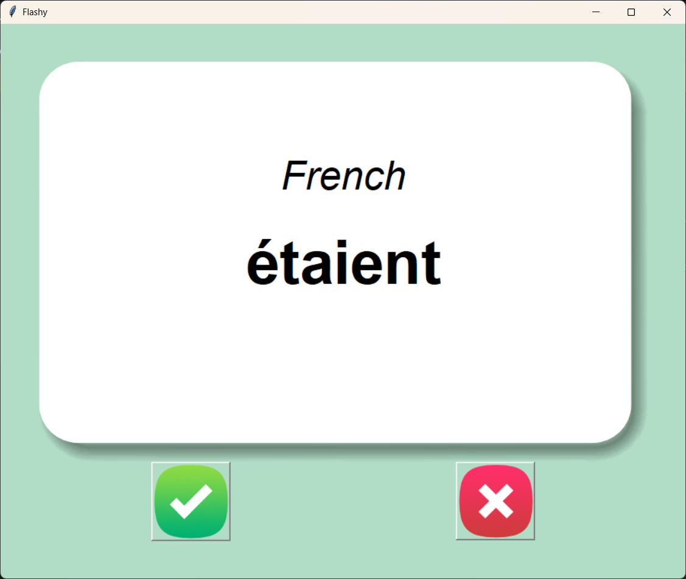
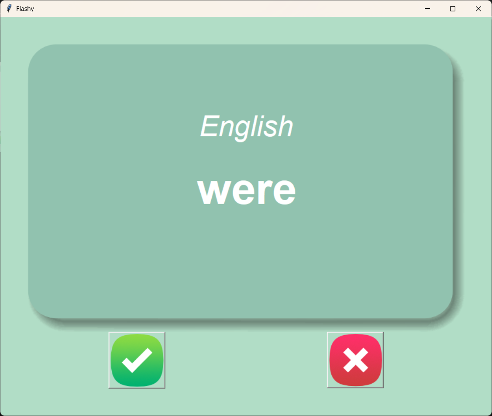
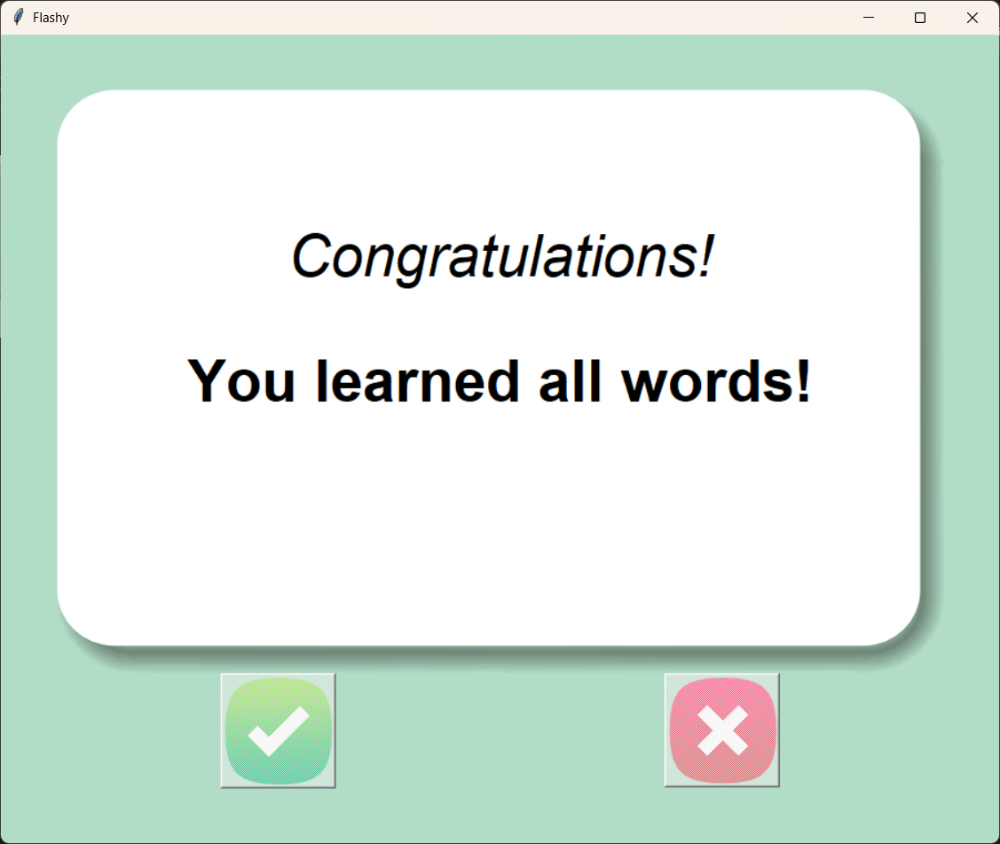
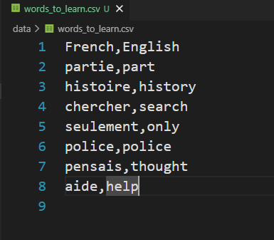

# Flashy - Vocabulary Flashcards


Flashy is a language learning desktop application built with Python and Tkinter. It helps you memorize new vocabulary using the flashcard method. The app shows you a word in French, waits for a few seconds, and then flips the card to reveal the English translation. It tracks your progress by saving the words you still need to learn in a local file.

## 📸 Screenshots

| Main Flashcard | Word Translated |
| --- | --- |
|  |  |

| All Words Learned | Progress Saved |
| --- | --- |
|  |  |

## ✨ Features

- Learn new vocabulary through an interactive flashcard interface.
- Automatically flips the card after 3 seconds to reveal the translation.
- Click the **Check (Right)** button if you knew the word; it gets removed from your study list.
- Click the **Cross (Wrong)** button if you didn't know the word; it stays in your study list.
- Saves your progress locally in a `words_to_learn.csv` file so you can pick up right where you left off.
- Shows a congratulatory message when you have learned all the words.

## 🛠️ Tech Stack

- **Python** - Core programming language
- **Tkinter** - Built-in GUI library for the interface
- **Pandas** - For reading, writing, and manipulating the CSV data files

## ⚙️ How It Works

1. The app loads words from `data/words_to_learn.csv` if it exists. If it's your first time or you've deleted the progress file, it loads the full vocabulary list from `data/french_words.csv`.
2. A random French word is displayed on the screen.
3. After 3 seconds, the card flips to show the English translation.
4. If you knew the word, click the **✔️ Check button**. This removes the word from your list and updates the `words_to_learn.csv` file.
5. If you didn't know the word, click the **❌ Cross button**. The word will remain in your list to be reviewed later.
6. The process repeats until you have learned all the words in the list!

## 📦 Installation

### 1. Clone the Repository

```bash
git clone https://github.com/seiffayed/Vocab_Flashcards_App.git
cd Vocab_Flashcards_App
```

### 2. Install Requirements

Tkinter is included with most Python installations, but `pandas` must be installed manually.

```bash
pip install pandas
```

### 3. Run the App

```bash
python main.py
```

## 📁 Project Structure

```text
Vocab_Flashcards_App/
|-- assets/
|   `-- screenshots/
|       |-- flashcard-front.png
|       |-- flashcard-back.png
|       |-- all-words-learned.png
|       `-- words-to-learn-csv.png
|-- data/
|   |-- french_words.csv
|   `-- words_to_learn.csv
|-- images/
|   |-- card_back.png
|   |-- card_front.png
|   |-- right.png
|   `-- wrong.png
|-- main.py
|-- README.md
|-- LICENSE
`-- .gitignore
```

## 🎓 Credits

This project is part of the **100 Days of Code: The Complete Python Pro Bootcamp** learning path.

## 📄 License

This project is licensed under the MIT License. See the `LICENSE` file for details.

## 🙌 Author

Built by **SeiF Fayed** as a Python Tkinter project to master GUI development and reading/writing data with pandas.
